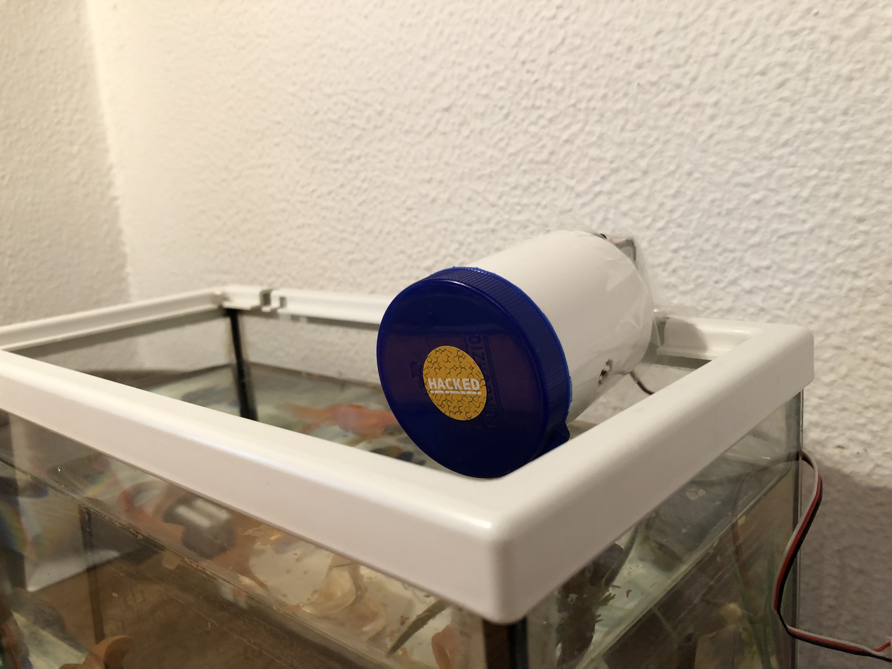

# fishFeeder
fishFeeder is an Arduino (ESP8266) Telegram controlled fish feeder which I use to feed my fish when I'm away.

## Components

* [NodeMCU - ESP8266](https://www.nodemcu.com/index_en.html)
* [Servo Motor](http://descargas.cetronic.es/microservo.pdf)

## Parameters to change:

To generate your new Bot, you need an Access Token. Talk to [BotFather](https://telegram.me/botfather) and follow a few simple steps described [here](https://core.telegram.org/bots#botfather).

Replace with your Telegram Token in `fishFeeder.ino`:

    #define BOTtoken "XXXXXXXXX:XXXXXXXXXXXXXXXXXXXXXXXXXXXXXXXXXXX"
   
Replace with your `chat_id` to prevent other people from feeding your fish

    if ( chat_id != "REPLACEME")
          bot.sendMessage(chat_id, "Hey, you are not allowed to play with my fish!", "");
    
In `secrets.h`, fill with your WiFi SSID and password:

    #define SECRET_SSID ""
    #define SECRET_PASS ""
    
Necessary libraries:

    #include <ESP8266WiFi.h>
    #include <WiFiClientSecure.h>
    #include <UniversalTelegramBot.h>
    #include <Servo.h>
    #include "secrets.h"
    
You also have to install the ArduinoJson library written by [Benoît Blanchon](https://github.com/bblanchon). Search for it on the Arduino Library manager or get it from [here](https://github.com/bblanchon/ArduinoJson).
    
## How to control the fish feeder via Telegram Bot:

